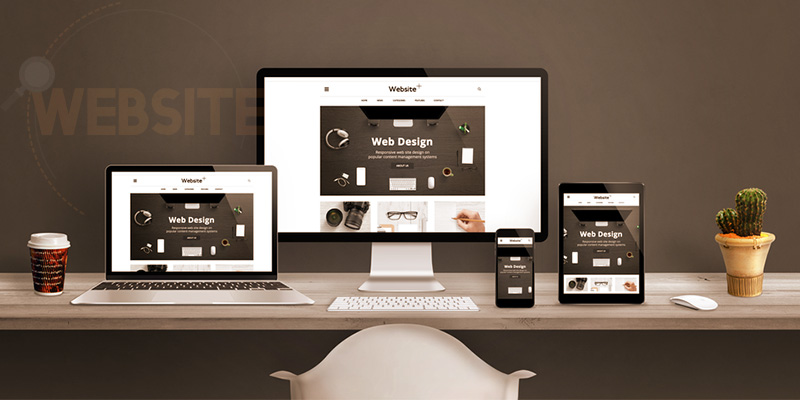

<!DOCTYPE html>

<html>

<head>

    <meta charset="utf-8">

    <meta name="description" content="web design">

    <title>Alstar</title>

    <link rel="stylesheet" href="css/normalize.css">

    <link rel="stylesheet" href="css/fontawesome/css/all.css">

    <link rel="stylesheet" href="css/style.css">

    <link rel="stylesheet" href="css/responsive.css">

    <link rel="preconnect" href="https://fonts.gstatic.com">

    <link href="https://fonts.googleapis.com/css2?family=Lobster&display=swap" rel="stylesheet">

</head>

<body>

    <nav>

        <ul>

            
                <li> Alstar</li>
            

            <li><a href="#contact">Contact</a></li>

            <li><a href="#team">Team</a></li>

            <li><a href="#works">Works</a></li>

            <li><a href="#numbers">service</a></li>

            <li><a href="#About">About</a></li>

            <li><a href="#header">Home</a></li>

        </ul>

    </nav>

    <!--start header-->

    <header id="header">

        <!--start nav-->

        

            

                <!--start intro-->

                

                    <h1 class="upper">Sequi ea ut et est quaerat</h1>
                    
 Ut enim ad minim veniam, quis nostrud exercitation ullamco laboris nisi ut aliquip ex ea commodo consequat.

                     
                    <button> Read More </button>

                

            

        

    </header>

    

        <h1 class="text-center">ABOUT US</h1>

        
"Lorem ipsum dolor sit amet, consectetur adipiscing elit, sed do eiusmod tempor incididunt ut.

        

            

            
 Lorem ipsum dolor sit amet, consectetur adipiscing elit, sed do eiusmod tempor incididunt ut labore   et dolore magna aliqua. Ut enim ad minim veniam, quis nostrud exercitation ullamco laboris nisi ut aliquip ex ea commodo consequatLorem ipsum dolor sit amet, consectetur adipiscing elit, sed do eiusmod tempor incididunt ut labore et dolore magna aliqua. Ut enim ad minim veniam.

        

    

    

        

            
Palace

            
ASER

            
BARBER

            
ULAYER

        

    

    <!--works-->

    

        

            <h2>Works</h2>

            
Lorem ipsum dolor sit amet, consectetur adipiscing elit.

            

                

                    

                    

                        <h2 class="upper">Our Project</h2>

                        
Lorem ipsum dolor sit amet, consectetur adipiscing elit.

                        <button class="btn">show project</button>

                    

                

                

                    

                    

                        <h2 class="upper">Our Project</h2>

                        
Lorem ipsum dolor sit amet, consectetur adipiscing elit.

                        <button class="btn">show project</button>

                    

                

                

                    

                    

                        <h2 class="upper">Our Project</h2>

                        
Lorem ipsum dolor sit amet, consectetur adipiscing elit.

                        <button class="btn">show project</button>

                    

                

                

                    

                    

                        <h2 class="upper">Our Project</h2>

                        
Lorem ipsum dolor sit amet, consectetur adipiscing elit.

                        <button class="btn">show project</button>

                    

                

                

                    

                    

                        <h2 class="upper">Our Project</h2>

                        
Lorem ipsum dolor sit amet, consectetur adipiscing elit.

                        <button class="btn">show project</button>

                    

                

                

                    

                    

                        <h2 class="upper">Our Project</h2>

                        
Lorem ipsum dolor sit amet, consectetur adipiscing elit.

                        <button class="btn">show project</button>

                    

                

                

                    

                    

                        <h2 class="upper">Our Project</h2>

                        
Lorem ipsum dolor sit amet, consectetur adipiscing elit.

                        <button class="btn">show project</button>

                    

                

                

                    

                    

                        <h2 class="upper">Our Project</h2>

                        
Lorem ipsum dolor sit amet, consectetur adipiscing elit.

                        <button class="btn">show project</button>

                    

                

                

                    

                    

                        <h2 class="upper">Our Project</h2>

                        
Lorem ipsum dolor sit amet, consectetur adipiscing elit.

                        <button class="btn">show project</button>

                    

                

            

        

    

    <!--team-->

    

        <h1 class="text-center">OUR TEAM</h1>

        
 Lorem ipsum dolor sit amet, consectetur adipiscing elit, sed do eiusmod tempor incididunt ut labore.

        

            

                

            

            

                

            

            

                

            

            

                

            

        

        

            <h1>John Harmon</h1>

            <h1>Mike Wilfer</h1>

            <h1>Mortmer hexam</h1>

            <h1>Jesse Hexam</h1>

        

    

    

        <h1 class="text-center">contact us</h1>
         
        
Lorem ipsum dolor sit amet, consectetur adipiscing elit, sed do eiusmod tempor incididunt ut labore  sed do eiusmod tempor incididunt ut labore.

         
        <form>
            <h4>

                <textarea type="text" placeholder="Enter Your Name" name="Name" cols="40" rows="1" style="width: 60%;"></textarea>

                 

                <textarea type="text" placeholder="Enter Your Email" name="Email" cols="40" rows="1" style="width: 60%;"></textarea>
            </h4>

            <h3>

                <textarea rows="3" cols="35" name="message" placeholder="Enter Your message" style="width: 60%;"></textarea>

                  
                <button> SEND MESSAGE </button>
            </h3>

        </form>
    

    

        CopyRight 2020 &copy; Ahmed

    

</body>

</html>
